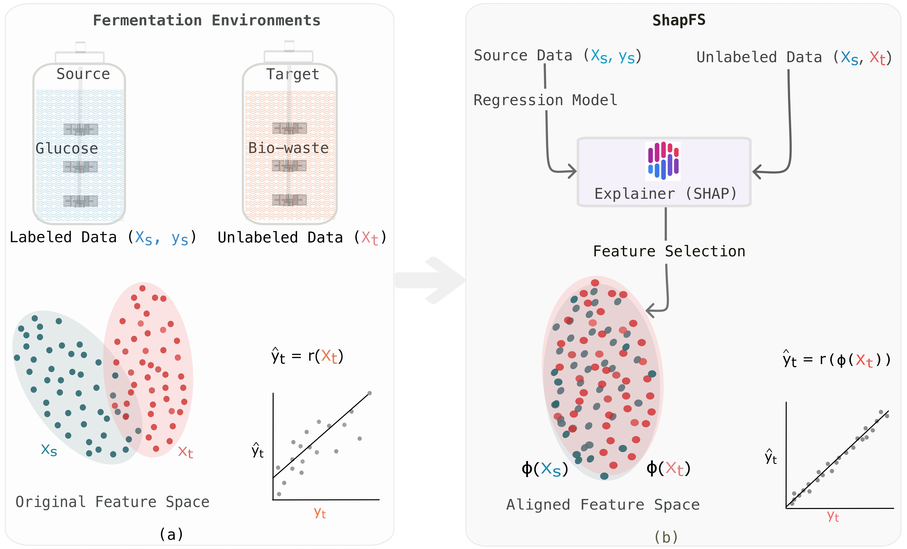

<div align="center">
  <br>
  
  <strong>ShapFS: SHapley Additive exPlanations-based Feature Selection</strong>

</div>

Code for our paper: Domain-Invariant Monitoring for Lactic Acid Production: Transfer Learning from Glucose to Bio-Waste Using Machine Learning Interpretation


## Table of Contents

1. 🔍 [About](#-about)
2. ⚙️ [Installation](#-installation)
3. 🤖 [Training and Evaluation](#-training-and-evaluation)
4. 📊 [Results](#-results)


## 🔍 About


**Unsupervised Domain Adaptation in Lactic Acid Production**: The source domain uses simple glucose (SG) while the target domain uses complex bio-waste hydrolysate (CW). Subplot (a) shows FTIR data for the source ($X_s$) and target ($X_t$), highlighting the domain shift. Subplot (b) presents ShapFS, which identifies domain-invariant features. A regression model trained on these features enhances target predictions ($\hat{y}_t$), mitigating the effects of domain shift.
   
## ⚙️ Installation
To reproduce our results, please kindly create and use the following environment.

```python
git clone https://github.com/shl-shawn/ShapFS.git
cd ShapFS
conda create -n ShapFS python
conda activate ShapFS
pip install -r requirements.txt
```

## 🤖 Training and Evaluation

The following deep models can be executed with their default parameters. To run the training and testing scripts, ensure that the correct paths to the dataset, model weights, and save directory are specified (i.e., `weight_path`, `dataset_dir` and `save_dir`).


### Domain Adversarial Neural Networks for Regression (DANN-R)
```python
#Train
cd src/DANN-R
python train.py

#Test
cd src/DANN-R
python test.py
```

### Domain Adaptation Regression with GRAM matrices (DARE-GRAM)
```python
#Train
cd src/DARE-GRAM
python train.py

#Test
cd src/DARE-GRAM
python test.py
```

### Deep Correlation Alignment for Regression (DeepCORAL-R)
```python
#Train
cd src/DeepCORAL-R
python train.py

#Test
cd src/DeepCORAL-R
python test.py
```

### ShapFS

```bash
cd src/ShapFS
```
- **`shapfs_glucose.ipynb`**: Implements the ShapFS method for predicting glucose concentration in both source and target domains.
- **`shapfs_lacticacid.ipynb`**: Applies ShapFS to predict lactic acid concentration across source and target domains.
- **`shapfs_combine.ipynb`**: Combines domain-invariant features for glucose and lactic acid to evaluate their impact on prediction accuracy.


## 📊 Results

### Glucose prediction

<table>
  <thead>
    <tr>
      <th rowspan="2">DA Methods</th>
      <th colspan="4">Source (SG)</th>
      <th colspan="4">Target (CW)</th>
    </tr>
    <tr>
      <th>R² ↑</th>
      <th>RMSE [g/L] ↓</th>
      <th>RMSEP [%] ↓</th>
      <th>RPD ↑</th>
      <th>R² ↑</th>
      <th>RMSE [g/L] ↓</th>
      <th>RMSEP [%] ↓</th>
      <th>RPD ↑</th>
    </tr>
  </thead>
  <tbody>
    <tr>
      <td style="white-space: nowrap;">No Adaptation</td>
      <td><strong>0.98</strong></td>
      <td>4.4</td>
      <td>3.8</td>
      <td>8.3</td>
      <td>0.56</td>
      <td>20.4</td>
      <td>14.2</td>
      <td>1.5</td>
    </tr>
    <tr>
      <td style="white-space: nowrap;">DeepCORAL-R</td>
      <td>0.80</td>
      <td>18.0</td>
      <td>15.9</td>
      <td>2.2</td>
      <td>0.69</td>
      <td>17.3</td>
      <td>12.0</td>
      <td>1.8</td>
    </tr>
    <tr>
      <td>DANN-R</td>
      <td>0.89</td>
      <td>13.0</td>
      <td>11.5</td>
      <td>3.1</td>
      <td>0.86</td>
      <td>11.5</td>
      <td>8.0</td>
      <td>2.7</td>
    </tr>
    <tr>
      <td>DARE-GRAM</td>
      <td><strong>0.98</strong></td>
      <td>5.0</td>
      <td>4.5</td>
      <td>8.0</td>
      <td>0.92</td>
      <td>8.7</td>
      <td>6.0</td>
      <td>3.6</td>
    </tr>
    <tr style="background-color: #d1e7dd;">
      <td><strong>ShapFS (ours)</strong></td>
      <td><strong>0.98</strong></td>
      <td><strong>4.3</strong></td>
      <td><strong>3.7</strong></td>
      <td><strong>8.5</strong></td>
      <td><strong>0.96</strong></td>
      <td><strong>5.8</strong></td>
      <td><strong>4.0</strong></td>
      <td><strong>5.4</strong></td>
    </tr>
  </tbody>
</table>

*Table 1: Unsupervised domain adaptation results for glucose prediction in source (SG) and target (CW) fermentations. Arrows indicate desired direction: ↑ (higher is better), ↓ (lower is better).*


### Lactic acid prediction

<table>
  <thead>
    <tr>
      <th rowspan="2">DA Methods</th>
      <th colspan="4">Source (SG)</th>
      <th colspan="4">Target (CW)</th>
    </tr>
    <tr>
      <th>R² ↑</th>
      <th>RMSE [g/L] ↓</th>
      <th>RMSEP [%] ↓</th>
      <th>RPD ↑</th>
      <th>R² ↑</th>
      <th>RMSE [g/L] ↓</th>
      <th>RMSEP [%] ↓</th>
      <th>RPD ↑</th>
    </tr>
  </thead>
  <tbody>
    <tr>
      <td style="white-space: nowrap;">No Adaptation</td>
      <td><strong>0.99</strong></td>
      <td>3.3</td>
      <td>3.9</td>
      <td>9.0</td>
      <td>0.79</td>
      <td>9.4</td>
      <td>10.6</td>
      <td>2.2</td>
    </tr>
    <tr>
      <td style="white-space: nowrap;">DeepCORAL-R</td>
      <td>0.95</td>
      <td>6.1</td>
      <td>6.9</td>
      <td>4.6</td>
      <td>0.82</td>
      <td>8.4</td>
      <td>9.5</td>
      <td>2.4</td>
    </tr>
    <tr>
      <td>DANN-R</td>
      <td>0.88</td>
      <td>9.5</td>
      <td>10.8</td>
      <td>3.9</td>
      <td>0.83</td>
      <td>8.2</td>
      <td>9.2</td>
      <td>2.5</td>
    </tr>
    <tr>
      <td>DARE-GRAM</td>
      <td>0.90</td>
      <td>8.9</td>
      <td>10.2</td>
      <td>3.1</td>
      <td>0.87</td>
      <td>7.3</td>
      <td>8.2</td>
      <td>2.8</td>
    </tr>
    <tr style="background-color: #d1e7dd;">
      <td><strong>ShapFS (ours)</strong></td>
      <td><strong>0.99</strong></td>
      <td><strong>3.1</strong></td>
      <td><strong>3.7</strong></td>
      <td><strong>9.7</strong></td>
      <td><strong>0.91</strong></td>
      <td><strong>6.1</strong></td>
      <td><strong>6.8</strong></td>
      <td><strong>3.3</strong></td>
    </tr>
  </tbody>
</table>

*Table 2: Unsupervised domain adaptation results for lactic acid prediction from source (SG) to target (CW) fermentations. Arrows indicate desired direction: ↑ (higher is better), ↓ (lower is better).*


## 🙏 Acknowledgement 
+ DANN-R is developed from [DANN](https://github.com/NaJaeMin92/pytorch-DANN).  
+ DARE-GRAM is used as our [codebase](https://github.com/ismailnejjar/DARE-GRAM). 
+ DeepCORAL-R is developed from [DeepCORAL](https://github.com/SSARCandy/DeepCORAL).

## 🧪 Data
The files should be extracted and placed in the `dataset` folder. For access to the dataset, please contact the corresponding author.


