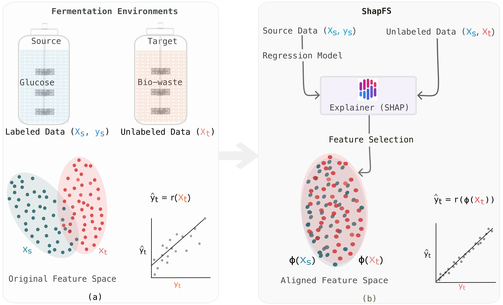

# SHapley Additive exPlanations-based Feature Selection (ShapFS)
Code for our paper: Domain-Invariant Monitoring for Lactic Acid Production: Transfer Learning from Glucose to Bio-Waste Using Machine Learning Interpretation




*Figure 1: Domain adaptation in lactic acid production: simple glucose (SG) in the source and bio-waste hydrolysate (CW) in the target. Subplot (a) shows FTIR data for source ($`X_s`$) and target ($`X_t`$), highlighting domain shift. Subplot (b) introduces ShapFS, identifying domain-invariant features. The regression model trained with these features improves target prediction ($`\hat{y}_t`$), reducing the domain shift impact.*


## Installation
Please create and activate the following conda envrionment. To reproduce our results, please kindly create and use this environment.

```python
git clone https://github.com/shl-shawn/ShapFS.git
cd ShapFS
conda create -n ShapFS python
conda activate ShapFS
pip install -r requirements.txt
```

## Train and Test Deep Learning models
The program can be executed with the default parameters. To run the training and testing scripts, ensure that the correct paths to the dataset, model weights, and save directory are specified (i.e., `weight_path`, `dataset_dir` and `save_dir`).

### DANN-R
```python
#Train
cd src/DANN-R
python train.py

#Test
cd src/DANN-R
python test.py
```

### DARE-GRAM
```python
#Train
cd src/DARE-GRAM
python train.py

#Test
cd src/DARE-GRAM
python test.py
```

### DeepCORAL-R
```python
#Train
cd src/DeepCORAL-R
python train.py

#Test
cd src/DeepCORAL-R
python test.py
```


## Experiment results

### Glucose prediction experiment results

<table>
  <thead>
    <tr>
      <th rowspan="2">DA Methods</th>
      <th colspan="4">Source (SG)</th>
      <th colspan="4">Target (CW)</th>
    </tr>
    <tr>
      <th>R² ↑</th>
      <th>RMSE [g/L] ↓</th>
      <th>RMSEP [%] ↓</th>
      <th>RPD ↑</th>
      <th>R² ↑</th>
      <th>RMSE [g/L] ↓</th>
      <th>RMSEP [%] ↓</th>
      <th>RPD ↑</th>
    </tr>
  </thead>
  <tbody>
    <tr>
      <td>No Adaptation</td>
      <td><strong>0.98</strong></td>
      <td>4.4</td>
      <td>3.8</td>
      <td>8.3</td>
      <td>0.56</td>
      <td>20.4</td>
      <td>14.2</td>
      <td>1.5</td>
    </tr>
    <tr>
      <td>DeepCORAL-R</td>
      <td>0.80</td>
      <td>18.0</td>
      <td>15.9</td>
      <td>2.2</td>
      <td>0.69</td>
      <td>17.3</td>
      <td>12.0</td>
      <td>1.8</td>
    </tr>
    <tr>
      <td>DANN-R</td>
      <td>0.89</td>
      <td>13.0</td>
      <td>11.5</td>
      <td>3.1</td>
      <td>0.86</td>
      <td>11.5</td>
      <td>8.0</td>
      <td>2.7</td>
    </tr>
    <tr>
      <td>DARE-GRAM</td>
      <td><strong>0.98</strong></td>
      <td>5.0</td>
      <td>4.5</td>
      <td>8.0</td>
      <td>0.92</td>
      <td>8.7</td>
      <td>6.0</td>
      <td>3.6</td>
    </tr>
    <tr style="background-color: #d1e7dd;">
      <td><strong>ShapFS</strong></td>
      <td><strong>0.98</strong></td>
      <td><strong>4.3</strong></td>
      <td><strong>3.7</strong></td>
      <td><strong>8.5</strong></td>
      <td><strong>0.96</strong></td>
      <td><strong>5.8</strong></td>
      <td><strong>4.0</strong></td>
      <td><strong>5.4</strong></td>
    </tr>
  </tbody>
</table>


*Table 1: Unsupervised domain adaptation results for glucose in source fermentation using glucose as the substrate (SG) and target fermentation using complex sugar from waste as the substrate (CW). Here DeepCORAL-R is Deep Correlation Alignment for Regression, DANN-R is Domain Adversarial Neural Networks for Regression, and ShapFS is SHapley Additive exPlanations-based domain invariant feature selection method.*


### Lactic acid prediction experiment results

<table>
  <thead>
    <tr>
      <th rowspan="2">DA Methods</th>
      <th colspan="4">Source (SG)</th>
      <th colspan="4">Target (CW)</th>
    </tr>
    <tr>
      <th>R² ↑</th>
      <th>RMSE [g/L] ↓</th>
      <th>RMSEP [%] ↓</th>
      <th>RPD ↑</th>
      <th>R² ↑</th>
      <th>RMSE [g/L] ↓</th>
      <th>RMSEP [%] ↓</th>
      <th>RPD ↑</th>
    </tr>
  </thead>
  <tbody>
    <tr>
      <td>No Adaptation</td>
      <td><strong>0.99</strong></td>
      <td>3.3</td>
      <td>3.9</td>
      <td>9.0</td>
      <td>0.79</td>
      <td>9.4</td>
      <td>10.6</td>
      <td>2.2</td>
    </tr>
    <tr>
      <td>DeepCORAL-R</td>
      <td>0.95</td>
      <td>6.1</td>
      <td>6.9</td>
      <td>4.6</td>
      <td>0.82</td>
      <td>8.4</td>
      <td>9.5</td>
      <td>2.4</td>
    </tr>
    <tr>
      <td>DANN-R</td>
      <td>0.88</td>
      <td>9.5</td>
      <td>10.8</td>
      <td>3.9</td>
      <td>0.83</td>
      <td>8.2</td>
      <td>9.2</td>
      <td>2.5</td>
    </tr>
    <tr>
      <td>DARE-GRAM</td>
      <td>0.90</td>
      <td>8.9</td>
      <td>10.2</td>
      <td>3.1</td>
      <td>0.87</td>
      <td>7.3</td>
      <td>8.2</td>
      <td>2.8</td>
    </tr>
    <tr style="background-color: #d1e7dd;">
      <td><strong>ShapFS</strong></td>
      <td><strong>0.99</strong></td>
      <td><strong>3.1</strong></td>
      <td><strong>3.7</strong></td>
      <td><strong>9.7</strong></td>
      <td><strong>0.91</strong></td>
      <td><strong>6.1</strong></td>
      <td><strong>6.8</strong></td>
      <td><strong>3.3</strong></td>
    </tr>
  </tbody>
</table>


*Table 2: Lactic acid prediction results using unsupervised domain adaptation from source fermentation using glucose as the substrate (SG) to target fermentation using complex sugar from waste as the substrate (CW).*
 


## Data
The files should be extracted and placed in the `dataset` folder. For access to the dataset, please contact the corresponding author.


## Acknowledgement 
+ DANN-R is developed from DANN [official](https://github.com/NaJaeMin92/pytorch-DANN)  
+ DARE-GRAM is used as our codebase [official](https://github.com/ismailnejjar/DARE-GRAM)  
+ DeepCORAL-R is developed from DeepCORAL [official](https://github.com/SSARCandy/DeepCORAL) 


## Contact
For questions regarding the code and data, please contact MBabor@atb-potsdam.de or SLiu@atb-potsdam.de .
